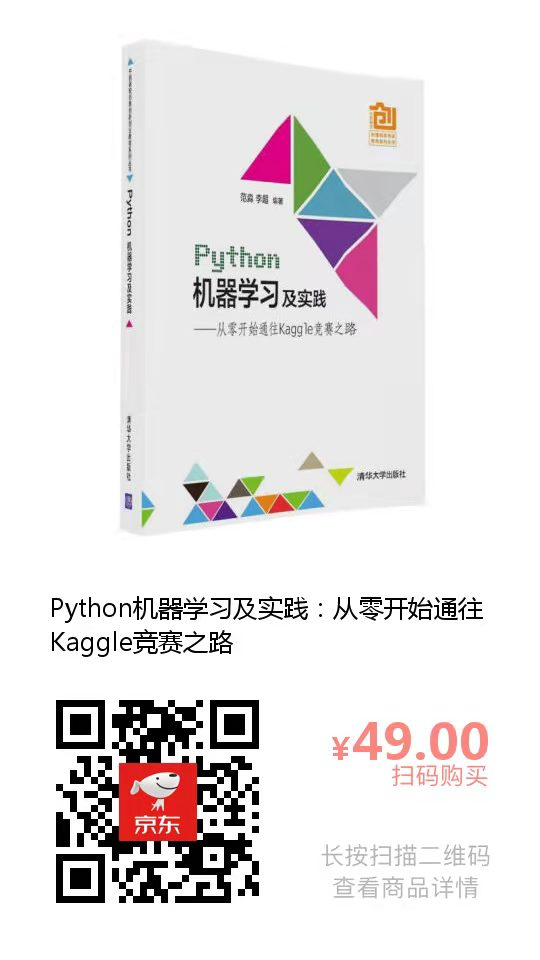

## 《Python机器学习及实践：从零开始通往Kaggle竞赛之路（第1版）》

### 1. 购书链接：

### 2. 官方QQ群：

### 3. 代码下载：
- 我们推荐中国大陆地区的读者从Gitee平台上下载：https://gitee.com/godfanmiao/ML-Kaggle-Gitee-2016 
- 建议港、澳、台，以及海外地区的读者从Github平台上下载：http://github.com/godfanmiao/ML-Kaggle-Github-2016

